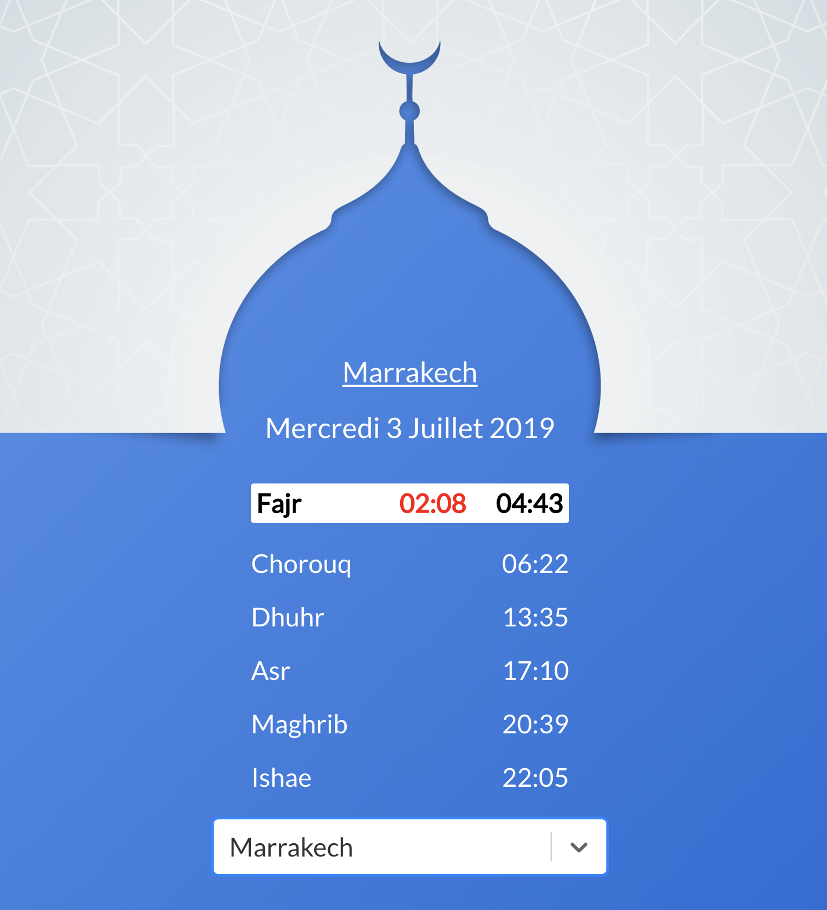

# Important

This project is no longer maintained. We have moved to a nextjs version https://github.com/kafiln/salat-next

# Description

A small web app to get prayers time in cities of Morocco

[Demo](https://kafiil.github.io/salat/)

## Todo

- [x] Use a cutom domain => buy one
- [x] Use typeahead instead of the boring list
- [x] Update UX/UI
- [x] Implement a toggle to change language and support arabic
